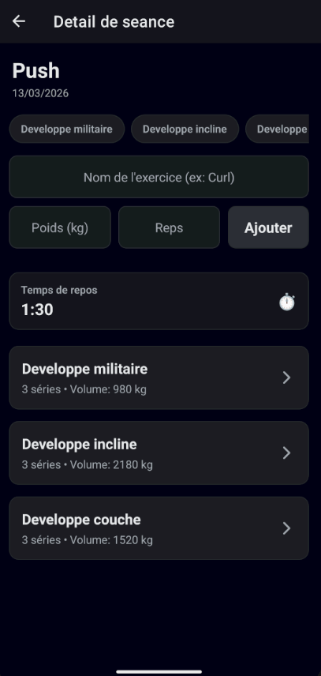
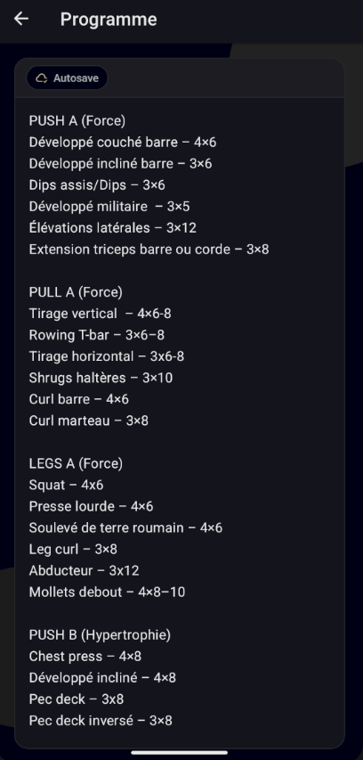
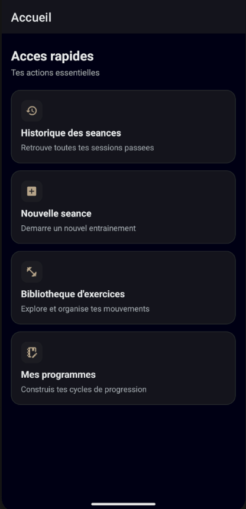

**GymTracker** est une application mobile native (iOS & Android) conçue pour offrir un suivi d'entraînement de musculation ultra-fluide, 100% hors-ligne et sans friction.
Pensée pour les pratiquants qui ont besoin de flexibilité, elle s'adapte à la volée aux séances imprévues tout en gardant une trace précise du volume d'entraînement (tonnage).

## Fonctionnalités Principales

- **Tracking de Séance Intelligent :** Regroupement dynamique des séries par exercice (UI en accordéon) avec calcul en temps réel du tonnage total soulevé.
- **Chronomètre Automatique :** Lancement automatique du temps de repos après chaque série validée, avec notification sonore et haptique (vibration) à la fin du délai.
- **Programmes Flexibles (Auto-save) :** Gestion de plusieurs routines d'entraînement via un éditeur de texte libre inspiré d'un "bloc-notes", avec sauvegarde automatique à chaque frappe.
- **100% Hors-Ligne & Rapide :** Base de données SQLite embarquée directement sur le téléphone. Aucune latence, aucune dépendance au réseau.
- **Édition Rapide :** Modification et suppression des séries à la volée via un système de modale fluide.

## Stack Technique

- **Framework :** React Native
- **Outils & Build :** Expo / EAS (Expo Application Services)
- **Navigation :** Expo Router (File-based routing)
- **Base de données :** Expo SQLite (Local Database)

## Architecture & Clean Code

Ce projet a été conçu avec une forte attention portée à la **lisibilité** et à la **maintenabilité** du code, en respectant les principes de la Clean Architecture :

1. **Séparation des Responsabilités (Custom Hooks) :**
   Toute la logique métier et les requêtes SQL sont extraites des composants visuels.
   _Exemple : `useSeanceManager.ts` ou `useProgrammeManager.ts` gèrent les états et la BDD de manière isolée._
2. **Composants Réutilisables (UI Components) :**
   Les interfaces complexes sont découpées en micro-composants (ex: `ExerciceGroupAccordion`, `SerieLogItem`, `EditSerieModal`).
3. **Absence de "God Components" :** Les écrans (`Screens`) agissent uniquement comme des chefs d'orchestre, assemblant les hooks et les composants visuels sans être surchargés de logique complexe.

## Installation & Lancement local

Si vous souhaitez faire tourner le projet sur votre propre machine :

1. **Cloner le repository :**
   git clone https://github.com/KillyanLcs/GymTracker.git
   cd GymTracker
2. **Installer les dépendances :**
   npm install
3. **Lancer le serveur de développement :**
   npx expo start
4. **Tester l'application :**
   Téléchargez l'application Expo Go sur votre smartphone (IOS ou Android).
   Scanner le QR code Affiché dans votre terminal

|            L'Écran de Séance             |               Mes Programmes                |                   l'Accueil                   |
| :--------------------------------------: | :-----------------------------------------: | :-------------------------------------------: |
|  |  |  |
